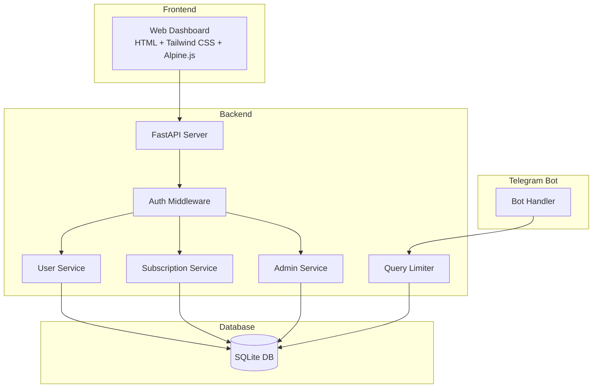

# Admin Dashboard Design Document

## Overview

Admin Dashboard adalah aplikasi web yang terintegrasi dengan Telegram Money Tracker Bot untuk memberikan kemampuan manajemen user dan sistem langganan kepada administrator. Dashboard dibangun menggunakan FastAPI sebagai backend dan HTML/CSS/JavaScript dengan Tailwind CSS untuk frontend yang modern dan responsif.

## Architecture



## Components and Interfaces

### 1. Admin API (FastAPI)

```python
# src/admin/api.py
class AdminAPI:
    """FastAPI router for admin endpoints."""
    
    # Authentication
    POST /api/admin/login -> LoginResponse
    POST /api/admin/logout -> LogoutResponse
    
    # User Management
    GET /api/admin/users -> PaginatedUserList
    GET /api/admin/users/{user_id} -> UserDetail
    PUT /api/admin/users/{user_id}/block -> UserDetail
    PUT /api/admin/users/{user_id}/unblock -> UserDetail
    DELETE /api/admin/users/{user_id} -> DeleteResponse
    
    # Subscription Management
    GET /api/admin/plans -> List[SubscriptionPlan]
    POST /api/admin/plans -> SubscriptionPlan
    PUT /api/admin/users/{user_id}/subscription -> UserSubscription
    
    # Query Limits
    PUT /api/admin/users/{user_id}/limits -> QueryLimits
    GET /api/admin/users/{user_id}/usage -> UsageStats
    
    # Analytics
    GET /api/admin/stats -> DashboardStats
    GET /api/admin/analytics/queries -> QueryAnalytics
```

### 2. User Service

```python
# src/admin/services/user_service.py
class UserService:
    """Service for user management operations."""
    
    def get_users(page: int, per_page: int, search: str) -> PaginatedResult
    def get_user(user_id: int) -> BotUser
    def block_user(user_id: int) -> BotUser
    def unblock_user(user_id: int) -> BotUser
    def delete_user(user_id: int) -> bool
    def get_user_stats() -> UserStats
```

### 3. Subscription Service

```python
# src/admin/services/subscription_service.py
class SubscriptionService:
    """Service for subscription management."""
    
    def get_plans() -> List[SubscriptionPlan]
    def create_plan(plan: SubscriptionPlanCreate) -> SubscriptionPlan
    def assign_subscription(user_id: int, plan_id: int, duration_days: int) -> UserSubscription
    def get_user_subscription(user_id: int) -> UserSubscription
    def check_expired_subscriptions() -> int
```

### 4. Query Limiter

```python
# src/admin/services/query_limiter.py
class QueryLimiter:
    """Service for enforcing query limits."""
    
    def set_limits(user_id: int, daily: int, monthly: int) -> QueryLimits
    def check_limit(user_id: int) -> LimitCheckResult
    def increment_usage(user_id: int) -> None
    def get_usage(user_id: int) -> UsageStats
    def reset_daily_limits() -> int
    def reset_monthly_limits() -> int
```

### 5. Auth Service

```python
# src/admin/services/auth_service.py
class AuthService:
    """Service for admin authentication."""
    
    def login(username: str, password: str) -> SessionToken
    def logout(token: str) -> bool
    def validate_session(token: str) -> AdminSession
    def cleanup_expired_sessions() -> int
```

## Data Models

### BotUser Model

```python
@dataclass
class BotUser:
    user_id: int                    # Telegram user ID
    username: Optional[str]         # Telegram username
    first_name: Optional[str]       # User's first name
    registered_at: datetime         # Registration timestamp
    last_active: datetime           # Last activity timestamp
    is_blocked: bool = False        # Block status
    subscription_id: Optional[int]  # Current subscription
    daily_query_limit: int = 10     # Daily query limit
    monthly_query_limit: int = 300  # Monthly query limit
    daily_queries_used: int = 0     # Today's query count
    monthly_queries_used: int = 0   # This month's query count
    total_queries: int = 0          # All-time query count
```

### SubscriptionPlan Model

```python
@dataclass
class SubscriptionPlan:
    id: int
    name: str                       # e.g., "Basic", "Premium"
    daily_query_limit: int          # Queries per day
    monthly_query_limit: int        # Queries per month
    price: float                    # Price in IDR
    duration_days: int              # Plan duration
    features: List[str]             # List of features
    is_active: bool = True
    created_at: datetime
```

### UserSubscription Model

```python
@dataclass
class UserSubscription:
    id: int
    user_id: int
    plan_id: int
    plan_name: str
    start_date: date
    end_date: date
    status: str                     # "active", "expired", "cancelled"
    assigned_by: str                # Admin who assigned
    assigned_at: datetime
```

### AdminSession Model

```python
@dataclass
class AdminSession:
    token: str
    admin_username: str
    created_at: datetime
    expires_at: datetime
    is_valid: bool = True
```

## Correctness Properties

*A property is a characteristic or behavior that should hold true across all valid executions of a system-essentially, a formal statement about what the system should do. Properties serve as the bridge between human-readable specifications and machine-verifiable correctness guarantees.*

### Property 1: User list contains required fields
*For any* API request to get users, all returned user objects SHALL contain user_id, username, registered_at, and is_blocked fields with valid values.
**Validates: Requirements 1.1**

### Property 2: User count consistency
*For any* user list response, the total_count field SHALL equal the actual count of users in the database matching the filter criteria.
**Validates: Requirements 1.2**

### Property 3: Search filter correctness
*For any* search query, all returned users SHALL have username or user_id containing the search term.
**Validates: Requirements 1.3**

### Property 4: User list sorting
*For any* user list response without explicit sort parameter, users SHALL be ordered by registered_at in descending order.
**Validates: Requirements 1.4**

### Property 5: Subscription assignment persistence
*For any* subscription assignment operation, querying the user's subscription immediately after SHALL return the assigned plan with correct start_date and end_date.
**Validates: Requirements 2.2**

### Property 6: Subscription plan completeness
*For any* created subscription plan, the plan SHALL contain name, duration_days, daily_query_limit, monthly_query_limit, and price fields.
**Validates: Requirements 2.3**

### Property 7: Query limit enforcement
*For any* user with a query limit, when usage equals or exceeds the limit, subsequent query requests SHALL be rejected.
**Validates: Requirements 3.1, 3.2, 3.3**

### Property 8: Block enforcement
*For any* blocked user, all bot command requests SHALL be rejected with blocked status.
**Validates: Requirements 4.1, 4.4**

### Property 9: Block-unblock round trip
*For any* user, blocking then unblocking SHALL restore the user's is_blocked status to False and restore access.
**Validates: Requirements 4.2**

### Property 10: User deletion completeness
*For any* deleted user, querying that user_id SHALL return not found.
**Validates: Requirements 4.3**

### Property 11: Authentication enforcement
*For any* API request without valid session token, the request SHALL be rejected with 401 status.
**Validates: Requirements 6.1, 6.2**

### Property 12: Session invalidation
*For any* logged-out or expired session token, subsequent API requests using that token SHALL be rejected.
**Validates: Requirements 6.3, 6.4**

### Property 13: Statistics accuracy
*For any* dashboard statistics request, total_users SHALL equal the count of users in database, and active_subscriptions SHALL equal count of non-expired subscriptions.
**Validates: Requirements 7.1**

## Error Handling

| Error Scenario | HTTP Status | Response |
|----------------|-------------|----------|
| Invalid credentials | 401 | `{"error": "Invalid username or password"}` |
| Session expired | 401 | `{"error": "Session expired", "code": "SESSION_EXPIRED"}` |
| User not found | 404 | `{"error": "User not found"}` |
| User already blocked | 400 | `{"error": "User is already blocked"}` |
| Invalid plan data | 422 | `{"error": "Validation error", "details": [...]}` |
| Database error | 500 | `{"error": "Internal server error"}` |

## Testing Strategy

### Unit Testing
- Test individual service methods with mocked database
- Test API endpoint handlers with mocked services
- Test authentication middleware with various token states
- Test query limiter logic with edge cases

### Property-Based Testing
Using `hypothesis` library for Python:

- **Property 1-4**: Generate random user data, test list/search/sort operations
- **Property 5-6**: Generate random subscription plans and assignments
- **Property 7**: Generate random usage counts and limits, verify enforcement
- **Property 8-10**: Generate random block/unblock/delete sequences
- **Property 11-12**: Generate random tokens and session states
- **Property 13**: Generate random user/subscription data, verify statistics

Each property-based test will:
- Run minimum 100 iterations
- Use smart generators for valid input data
- Tag with format: `**Feature: admin-dashboard, Property {N}: {description}**`

### Integration Testing
- Test full API flow from login to user management
- Test subscription assignment and expiration flow
- Test query limit enforcement end-to-end
