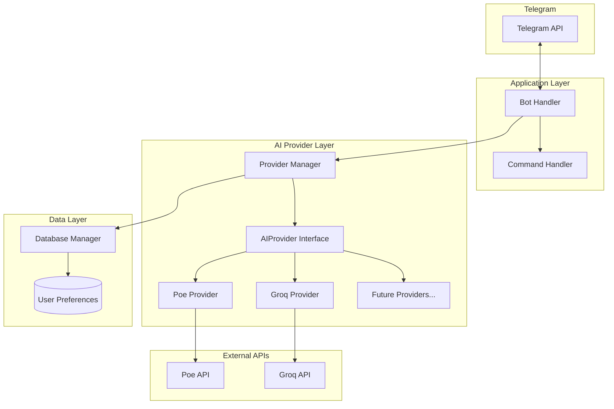

# Design Document

## Overview

Fitur AI Provider Selection memungkinkan bot Telegram Money Tracker untuk menggunakan berbagai AI provider (Poe, Groq, OpenAI, dll) dengan interface yang seragam. Pengguna dapat memilih provider dan model melalui command Telegram, dan preferensi disimpan per-user di database.

## Architecture



## Components and Interfaces

### 1. AIProvider Interface (`src/ai/providers/base.py`)

Abstract base class untuk semua AI providers.

```python
from abc import ABC, abstractmethod
from dataclasses import dataclass
from typing import Optional

@dataclass
class AIModel:
    id: str
    name: str
    description: Optional[str] = None

@dataclass
class ProviderInfo:
    name: str
    display_name: str
    is_configured: bool
    current_model: Optional[str] = None

class AIProvider(ABC):
    """Abstract base class for AI providers."""
    
    name: str  # Provider identifier (e.g., "poe", "groq")
    display_name: str  # Human-readable name
    
    @abstractmethod
    def __init__(self, api_key: str, base_url: str, model: str):
        """Initialize provider with credentials."""
        pass
    
    @abstractmethod
    def parse_transaction(self, message: str) -> Optional[ParsedTransaction]:
        """Parse natural language message into transaction data."""
        pass
    
    @abstractmethod
    def list_models(self) -> list[AIModel]:
        """Fetch available models from the provider."""
        pass
    
    @abstractmethod
    def test_connection(self) -> bool:
        """Test if the provider connection is working."""
        pass
    
    @abstractmethod
    def set_model(self, model_id: str) -> bool:
        """Set the active model for this provider."""
        pass
    
    def get_info(self) -> ProviderInfo:
        """Get provider information."""
        pass
```

### 2. Poe Provider (`src/ai/providers/poe.py`)

Existing Poe API implementation refactored to use new interface.

```python
class PoeProvider(AIProvider):
    name = "poe"
    display_name = "Poe (Quora)"
    
    def __init__(self, api_key: str, base_url: str = "https://api.poe.com/v1", model: str = "gemini-2.5-flash"):
        self.client = openai.OpenAI(api_key=api_key, base_url=base_url)
        self.model = model
    
    def parse_transaction(self, message: str) -> Optional[ParsedTransaction]:
        # Existing implementation
        pass
    
    def list_models(self) -> list[AIModel]:
        # Poe doesn't have a models endpoint, return predefined list
        return [
            AIModel("gemini-2.5-flash", "Gemini 2.5 Flash"),
            AIModel("gpt-4o", "GPT-4o"),
            AIModel("claude-3.5-sonnet", "Claude 3.5 Sonnet"),
        ]
    
    def test_connection(self) -> bool:
        # Try a simple completion
        pass
```

### 3. Groq Provider (`src/ai/providers/groq.py`)

New Groq API implementation.

```python
class GroqProvider(AIProvider):
    name = "groq"
    display_name = "Groq"
    
    def __init__(self, api_key: str, base_url: str = "https://api.groq.com/openai/v1", model: str = "llama-3.3-70b-versatile"):
        self.client = openai.OpenAI(api_key=api_key, base_url=base_url)
        self.model = model
        self.api_key = api_key
    
    def parse_transaction(self, message: str) -> Optional[ParsedTransaction]:
        # Same logic as Poe, using OpenAI-compatible API
        pass
    
    def list_models(self) -> list[AIModel]:
        """Fetch models from Groq API."""
        import httpx
        response = httpx.get(
            f"{self.base_url}/models",
            headers={"Authorization": f"Bearer {self.api_key}"}
        )
        models = response.json().get("data", [])
        return [AIModel(m["id"], m.get("id", m["id"])) for m in models]
    
    def test_connection(self) -> bool:
        # Try listing models
        pass
```

### 4. Provider Manager (`src/ai/provider_manager.py`)

Manages multiple providers and user preferences.

```python
class ProviderManager:
    """Manages AI providers and user preferences."""
    
    def __init__(self, settings: Settings, db_manager: DatabaseManager):
        self.providers: dict[str, AIProvider] = {}
        self.db_manager = db_manager
        self._init_providers(settings)
    
    def _init_providers(self, settings: Settings) -> None:
        """Initialize all configured providers."""
        if settings.poe_api_key:
            self.providers["poe"] = PoeProvider(
                api_key=settings.poe_api_key,
                base_url=settings.poe_base_url,
                model=settings.poe_model
            )
        if settings.groq_api_key:
            self.providers["groq"] = GroqProvider(
                api_key=settings.groq_api_key,
                model=settings.groq_model
            )
    
    def get_provider(self, user_id: int) -> AIProvider:
        """Get the active provider for a user."""
        pref = self.db_manager.get_user_preference(user_id)
        if pref and pref.provider in self.providers:
            provider = self.providers[pref.provider]
            if pref.model:
                provider.set_model(pref.model)
            return provider
        return self._get_default_provider()
    
    def set_user_provider(self, user_id: int, provider_name: str) -> bool:
        """Set user's preferred provider."""
        if provider_name not in self.providers:
            return False
        return self.db_manager.save_user_preference(user_id, provider_name, None)
    
    def set_user_model(self, user_id: int, model_id: str) -> bool:
        """Set user's preferred model."""
        pref = self.db_manager.get_user_preference(user_id)
        provider_name = pref.provider if pref else self._get_default_provider().name
        return self.db_manager.save_user_preference(user_id, provider_name, model_id)
    
    def list_providers(self) -> list[ProviderInfo]:
        """List all available providers with status."""
        pass
    
    def list_models(self, user_id: int) -> list[AIModel]:
        """List models for user's current provider."""
        provider = self.get_provider(user_id)
        return provider.list_models()
```

### 5. Updated Command Handler (`src/bot/commands.py`)

New commands for provider management.

```python
class CommandHandler:
    def __init__(self, db_manager: DatabaseManager, provider_manager: ProviderManager):
        self.db_manager = db_manager
        self.provider_manager = provider_manager
    
    async def cmd_provider(self, update: Update, context: ContextTypes.DEFAULT_TYPE) -> None:
        """Handle /provider [list|set provider_name] command."""
        args = context.args
        user_id = update.effective_user.id
        
        if not args:
            # Show current provider
            provider = self.provider_manager.get_provider(user_id)
            await update.message.reply_text(
                f"🤖 Provider aktif: {provider.display_name}\n"
                f"📦 Model: {provider.model}"
            )
        elif args[0] == "list":
            # List all providers
            providers = self.provider_manager.list_providers()
            # Format and send list
        elif args[0] == "set" and len(args) > 1:
            # Set provider
            success = self.provider_manager.set_user_provider(user_id, args[1])
            # Send result
    
    async def cmd_models(self, update: Update, context: ContextTypes.DEFAULT_TYPE) -> None:
        """Handle /models command - list available models."""
        user_id = update.effective_user.id
        models = self.provider_manager.list_models(user_id)
        # Format and send model list
    
    async def cmd_model(self, update: Update, context: ContextTypes.DEFAULT_TYPE) -> None:
        """Handle /model set [model_name] command."""
        args = context.args
        if args and args[0] == "set" and len(args) > 1:
            success = self.provider_manager.set_user_model(user_id, args[1])
            # Send result
```

## Data Models

### User Preference Model

```python
@dataclass
class UserPreference:
    user_id: int
    provider: str
    model: Optional[str] = None
    updated_at: datetime = None
```

### Database Schema Addition

```sql
-- Add to existing schema
CREATE TABLE IF NOT EXISTS user_preferences (
    user_id BIGINT PRIMARY KEY,
    provider VARCHAR(50) NOT NULL,
    model VARCHAR(100),
    updated_at TIMESTAMP DEFAULT CURRENT_TIMESTAMP ON UPDATE CURRENT_TIMESTAMP
);
```

### Updated Settings

```python
class Settings(BaseSettings):
    # Existing settings...
    
    # Poe API
    poe_api_key: str = ""
    poe_base_url: str = "https://api.poe.com/v1"
    poe_model: str = "gemini-2.5-flash"
    
    # Groq API
    groq_api_key: str = ""
    groq_base_url: str = "https://api.groq.com/openai/v1"
    groq_model: str = "llama-3.3-70b-versatile"
    
    # Default provider
    default_ai_provider: str = "poe"
```

## Correctness Properties

*A property is a characteristic or behavior that should hold true across all valid executions of a system-essentially, a formal statement about what the system should do. Properties serve as the bridge between human-readable specifications and machine-verifiable correctness guarantees.*

### Property 1: Provider Configuration Loading

*For any* set of environment variables with valid API keys, the ProviderManager should initialize providers for all configured keys, and each provider should be accessible by its name.

**Validates: Requirements 1.1, 3.4**

### Property 2: Provider Display Completeness

*For any* provider info response, the formatted output should contain the provider name and current model name.

**Validates: Requirements 1.2, 2.2**

### Property 3: Provider List Completeness

*For any* ProviderManager with N configured providers, calling list_providers() should return exactly N ProviderInfo objects, each with correct is_configured status.

**Validates: Requirements 1.3**

### Property 4: Provider Switch Consistency

*For any* configured provider name, calling set_user_provider() should succeed and subsequent calls to get_provider() for that user should return the newly set provider.

**Validates: Requirements 1.4, 4.1, 4.2**

### Property 5: Unconfigured Provider Rejection

*For any* provider name that is not in the configured providers list, calling set_user_provider() should return False and not change the user's current provider.

**Validates: Requirements 1.5**

### Property 6: Model Switch Consistency

*For any* valid model ID, calling set_user_model() should succeed and subsequent parsing operations should use the newly set model.

**Validates: Requirements 2.3**

### Property 7: User Preference Persistence Round Trip

*For any* user preference (provider + model), saving it to the database and then retrieving it should return an equivalent preference.

**Validates: Requirements 4.1**

### Property 8: Default Provider Fallback

*For any* user without saved preferences, get_provider() should return the default provider as configured in settings.

**Validates: Requirements 4.3**

### Property 9: Graceful Error Handling

*For any* AI provider API call that raises an exception, the operation should catch the error, log it, and return a user-friendly error message without crashing.

**Validates: Requirements 5.1, 5.4**

## Error Handling

### Error Categories

1. **Provider Not Configured**: API key missing for requested provider
   - Return clear message about which env var to set
   
2. **API Connection Error**: Provider API unreachable
   - Log error with details
   - Suggest trying different provider
   - Implement timeout (30 seconds default)

3. **Invalid Model**: Requested model not available
   - Return list of available models
   
4. **Rate Limiting**: Provider rate limit exceeded
   - Return message to wait and retry

### Error Response Format

```python
@dataclass
class ProviderResponse:
    success: bool
    message: str
    data: Optional[Any] = None
    error_code: Optional[str] = None
```

## Testing Strategy

### Unit Testing

Menggunakan `pytest` untuk unit tests:

1. **Provider Tests**
   - Test each provider initialization
   - Test parse_transaction with mocked API
   - Test list_models response parsing

2. **Provider Manager Tests**
   - Test provider initialization from settings
   - Test get_provider with/without user preference
   - Test set_user_provider/set_user_model

3. **Command Tests**
   - Test /provider command variations
   - Test /models command
   - Test /model set command

### Property-Based Testing

Menggunakan `hypothesis` library untuk property-based tests:

1. **Provider Configuration**: Generate random settings, verify correct providers initialized
2. **Provider Switch**: Generate random provider switches, verify consistency
3. **Preference Round Trip**: Generate random preferences, verify persistence
4. **Error Handling**: Generate various error conditions, verify graceful handling

### Test Configuration

- Minimum 100 iterations per property test
- Each property test tagged with: `**Feature: ai-provider-selection, Property {number}: {property_text}**`

