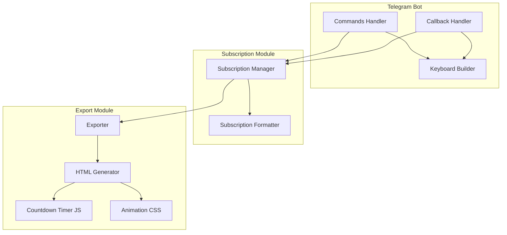

# Design Document: Enhanced Subscription UI

## Overview

Fitur ini meningkatkan tampilan dan interaksi subscription pada Money Tracker Bot dengan fokus pada:
- Live countdown timer untuk masa aktif langganan
- Tombol interaktif di Telegram dengan konfirmasi dialog
- HTML export dengan animasi modern dan filter/sort
- Statistik dan insights yang informatif

## Architecture



## Components and Interfaces

### 1. Enhanced Keyboard Builder

```python
class SubscriptionKeyboardBuilder:
    """Build interactive inline keyboards for subscription management."""
    
    @staticmethod
    def main_menu() -> InlineKeyboardMarkup:
        """Main subscription menu with action buttons."""
        pass
    
    @staticmethod
    def subscription_detail(sub_id: int) -> InlineKeyboardMarkup:
        """Detail view with Renew, Delete, Edit buttons."""
        pass
    
    @staticmethod
    def delete_confirmation(sub_id: int) -> InlineKeyboardMarkup:
        """Confirmation dialog for deletion."""
        pass
    
    @staticmethod
    def renew_options(sub_id: int) -> InlineKeyboardMarkup:
        """Renewal period options (1m, 3m, 6m, 1y)."""
        pass
    
    @staticmethod
    def filter_options() -> InlineKeyboardMarkup:
        """Filter buttons for status filtering."""
        pass
```

### 2. Enhanced Subscription Formatter

```python
class SubscriptionFormatter:
    """Format subscription data for display."""
    
    @staticmethod
    def format_countdown(days: int) -> str:
        """Format days remaining with emoji indicators."""
        pass
    
    @staticmethod
    def format_progress_emoji(progress: float) -> str:
        """Generate emoji progress bar."""
        pass
    
    @staticmethod
    def format_amount(amount: float) -> str:
        """Format currency with proper notation."""
        pass
    
    @staticmethod
    def format_relative_date(target_date: date) -> str:
        """Format date as relative time (e.g., '3 hari lagi')."""
        pass
```

### 3. Enhanced HTML Exporter

```python
class EnhancedSubscriptionExporter:
    """Generate interactive HTML export with animations."""
    
    @staticmethod
    def generate_html(
        subscriptions: list[Subscription],
        title: str = "Daftar Langganan"
    ) -> str:
        """Generate full HTML with countdown, animations, filters."""
        pass
    
    @staticmethod
    def _generate_countdown_js() -> str:
        """Generate JavaScript for live countdown timers."""
        pass
    
    @staticmethod
    def _generate_animation_css() -> str:
        """Generate CSS animations for modern look."""
        pass
    
    @staticmethod
    def _generate_filter_js() -> str:
        """Generate JavaScript for filtering and sorting."""
        pass
    
    @staticmethod
    def _generate_statistics_section(subscriptions: list[Subscription]) -> str:
        """Generate statistics and insights section."""
        pass
```

## Data Models

### Subscription Display Data

```python
@dataclass
class SubscriptionDisplayData:
    """Data structure for subscription display."""
    id: int
    name: str
    amount: float
    category: str
    start_date: date
    end_date: date
    status: str  # active, expiring_soon, expired
    days_remaining: int
    progress_percent: float
    countdown_text: str
    relative_date: str
    emoji_progress: str
```

### Filter State

```python
@dataclass
class FilterState:
    """State for subscription filtering."""
    status_filter: str = "all"  # all, active, expiring_soon, expired
    sort_by: str = "end_date"  # name, amount, end_date
    sort_order: str = "asc"  # asc, desc
    search_query: str = ""
```


## Correctness Properties

*A property is a characteristic or behavior that should hold true across all valid executions of a system-essentially, a formal statement about what the system should do. Properties serve as the bridge between human-readable specifications and machine-verifiable correctness guarantees.*

Based on the acceptance criteria analysis, the following correctness properties have been identified:

### Property 1: Warning indicators for expiring subscriptions
*For any* subscription with days_remaining less than 7, the system SHALL include warning visual indicators (warning colors in HTML, warning emoji in Telegram display).
**Validates: Requirements 1.2, 6.2**

### Property 2: Expired status display
*For any* subscription with end_date in the past (days_remaining <= 0), the system SHALL display "Expired" status with appropriate visual indicator.
**Validates: Requirements 1.3**

### Property 3: Detail keyboard contains action buttons
*For any* subscription ID, the detail keyboard SHALL contain Renew, Delete, and Edit action buttons with correct callback data.
**Validates: Requirements 2.2**

### Property 4: Total cost calculation accuracy
*For any* list of active subscriptions, the displayed total monthly cost SHALL equal the sum of all subscription amounts, and yearly cost SHALL equal monthly cost multiplied by 12.
**Validates: Requirements 5.1**

### Property 5: Category breakdown accuracy
*For any* list of subscriptions, the category breakdown SHALL correctly calculate the sum per category and the percentage relative to total.
**Validates: Requirements 5.2**

### Property 6: Upcoming renewals filter
*For any* list of subscriptions, the upcoming renewals section SHALL include exactly those subscriptions with end_date within the next 30 days.
**Validates: Requirements 5.3**

### Property 7: Emoji progress indicator accuracy
*For any* subscription with a valid progress percentage (0-100%), the emoji progress indicator SHALL visually represent the progress proportionally.
**Validates: Requirements 6.1**

### Property 8: Currency formatting consistency
*For any* numeric amount, the currency formatter SHALL produce a string in format "Rp X.XXX" with proper thousand separators.
**Validates: Requirements 6.3**

### Property 9: Relative date formatting accuracy
*For any* future date, the relative date formatter SHALL produce correct Indonesian relative time string (e.g., "3 hari lagi", "1 bulan lagi").
**Validates: Requirements 6.4**

## Error Handling

| Error Scenario | Handling Strategy |
|----------------|-------------------|
| Empty subscription list | Display friendly empty state message with "Add" button |
| Invalid subscription ID in callback | Show error message and return to main menu |
| HTML generation failure | Return error message, log details |
| Date calculation overflow | Cap at reasonable maximum (e.g., 9999 days) |
| Missing category | Default to "other" category |

## Testing Strategy

### Unit Tests
- Test keyboard builder produces correct button structures
- Test formatter functions with edge cases (0 days, negative days, large amounts)
- Test HTML generation contains required elements

### Property-Based Tests
Using `hypothesis` library for Python:

1. **Warning indicator property test**: Generate random subscriptions with various days_remaining values, verify warning indicators appear correctly for days < 7
2. **Expired status property test**: Generate subscriptions with past end dates, verify expired status display
3. **Detail keyboard property test**: Generate random subscription IDs, verify keyboard contains required buttons
4. **Total cost property test**: Generate lists of subscriptions, verify total calculations are accurate
5. **Category breakdown property test**: Generate subscriptions with various categories, verify breakdown accuracy
6. **Upcoming renewals property test**: Generate subscriptions with various end dates, verify correct filtering
7. **Emoji progress property test**: Generate progress percentages, verify emoji representation
8. **Currency formatting property test**: Generate random amounts, verify format consistency
9. **Relative date property test**: Generate future dates, verify relative time strings

Each property-based test will run minimum 100 iterations to ensure robustness.

Test annotations will follow format: `**Feature: enhanced-subscription-ui, Property {number}: {property_text}**`
