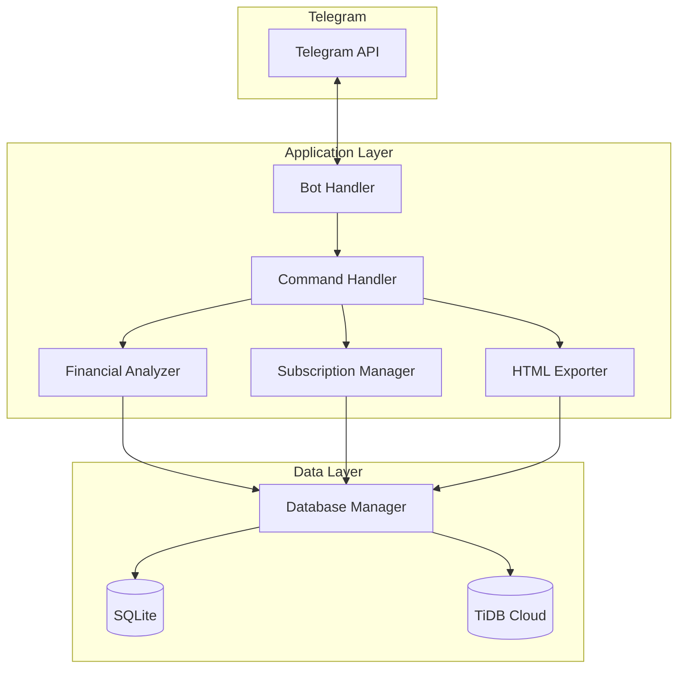

# Design Document

## Overview

Fitur tambahan untuk Bot Telegram Money Tracker yang menyediakan analisis kesehatan keuangan, manajemen subscription/langganan, dan export laporan HTML interaktif. Sistem terintegrasi dengan arsitektur existing (dual database SQLite + TiDB Cloud) dan menggunakan komponen modular.

## Architecture



## Components and Interfaces

### 1. Financial Analyzer (`src/analysis/analyzer.py`)

Komponen untuk menganalisis kesehatan keuangan pengguna.

```python
@dataclass
class FinancialHealth:
    score: int                    # 0-100
    income_total: float
    expense_total: float
    balance: float
    expense_ratio: float          # expense/income percentage
    savings_rate: float           # savings/income percentage
    top_categories: list[tuple[str, float, float]]  # (category, amount, percentage)
    trend: str                    # "improving", "stable", "declining"
    month_comparison: dict        # current vs previous month
    warnings: list[str]
    suggestions: list[str]

class FinancialAnalyzer:
    def __init__(self, db_manager: DatabaseManager):
        pass
    
    def analyze(self, user_id: int, month: int = None, year: int = None) -> FinancialHealth:
        """Perform comprehensive financial analysis."""
        pass
    
    def calculate_health_score(self, expense_ratio: float, savings_rate: float, 
                                category_diversity: float) -> int:
        """Calculate health score 0-100 based on multiple factors."""
        pass
    
    def get_expense_breakdown(self, transactions: list[Transaction]) -> list[tuple[str, float, float]]:
        """Get expense breakdown by category with amounts and percentages."""
        pass
    
    def compare_months(self, user_id: int, current_month: int, current_year: int) -> dict:
        """Compare current month with previous month."""
        pass
    
    def generate_suggestions(self, health: FinancialHealth) -> list[str]:
        """Generate personalized financial suggestions."""
        pass
```

### 2. Subscription Manager (`src/subscription/manager.py`)

Komponen untuk mengelola subscription/langganan.

```python
@dataclass
class Subscription:
    id: Optional[int]
    user_id: int
    name: str                     # e.g., "Netflix", "VPS DigitalOcean"
    amount: float                 # monthly cost
    category: str                 # streaming, hosting, domain, software, other
    start_date: date
    end_date: date
    is_active: bool
    notes: Optional[str]
    created_at: datetime
    
    @property
    def days_remaining(self) -> int:
        """Calculate days until expiration."""
        pass
    
    @property
    def status(self) -> str:
        """Return status: active, expiring_soon, expired."""
        pass

class SubscriptionManager:
    def __init__(self, db_manager: DatabaseManager):
        pass
    
    def add_subscription(self, subscription: Subscription) -> int:
        """Add new subscription, return ID."""
        pass
    
    def get_subscriptions(self, user_id: int, include_expired: bool = False) -> list[Subscription]:
        """Get all subscriptions for user."""
        pass
    
    def get_subscription_by_id(self, user_id: int, sub_id: int) -> Optional[Subscription]:
        """Get specific subscription."""
        pass
    
    def delete_subscription(self, user_id: int, sub_id: int) -> bool:
        """Delete subscription."""
        pass
    
    def renew_subscription(self, user_id: int, sub_id: int, new_end_date: date) -> bool:
        """Update subscription end date."""
        pass
    
    def get_expiring_soon(self, user_id: int, days: int = 7) -> list[Subscription]:
        """Get subscriptions expiring within specified days."""
        pass
    
    def get_monthly_cost(self, user_id: int) -> dict:
        """Calculate total monthly subscription cost with breakdown."""
        pass
    
    def get_by_category(self, user_id: int) -> dict[str, list[Subscription]]:
        """Group subscriptions by category."""
        pass
```

### 3. Enhanced HTML Exporter (`src/utils/exporter.py`)

Extend existing exporter dengan fitur subscription dan analysis.

```python
class TransactionExporter:
    # ... existing methods ...
    
    @staticmethod
    def to_html_full(
        transactions: list[Transaction],
        subscriptions: list[Subscription],
        analysis: FinancialHealth,
        title: str = "Laporan Keuangan Lengkap"
    ) -> str:
        """Generate comprehensive HTML report with all data."""
        pass
    
    @staticmethod
    def _generate_subscription_section(subscriptions: list[Subscription]) -> str:
        """Generate HTML section for subscriptions."""
        pass
    
    @staticmethod
    def _generate_analysis_section(analysis: FinancialHealth) -> str:
        """Generate HTML section for financial analysis."""
        pass
```

### 4. Extended Command Handler (`src/bot/commands.py`)

Tambahan command untuk fitur baru.

```python
class CommandHandler:
    # ... existing methods ...
    
    async def cmd_analysis(self, update: Update, context: ContextTypes.DEFAULT_TYPE) -> None:
        """Handle /analysis command - show financial health analysis."""
        pass
    
    async def cmd_addsub(self, update: Update, context: ContextTypes.DEFAULT_TYPE) -> None:
        """Handle /addsub [name] [amount] [start] [end] [category] command."""
        pass
    
    async def cmd_subs(self, update: Update, context: ContextTypes.DEFAULT_TYPE) -> None:
        """Handle /subs command - list all subscriptions."""
        pass
    
    async def cmd_delsub(self, update: Update, context: ContextTypes.DEFAULT_TYPE) -> None:
        """Handle /delsub [id] command."""
        pass
    
    async def cmd_renewsub(self, update: Update, context: ContextTypes.DEFAULT_TYPE) -> None:
        """Handle /renewsub [id] [new_end_date] command."""
        pass
    
    async def cmd_subcost(self, update: Update, context: ContextTypes.DEFAULT_TYPE) -> None:
        """Handle /subcost command - show subscription costs."""
        pass
    
    async def cmd_export(self, update: Update, context: ContextTypes.DEFAULT_TYPE) -> None:
        """Handle /export command - generate and send HTML report."""
        pass
```

## Data Models

### Subscription Model (`src/models/subscription.py`)

```python
from dataclasses import dataclass, field
from datetime import date, datetime
from typing import Optional

SUBSCRIPTION_CATEGORIES = [
    "streaming",    # Netflix, Spotify, YouTube Premium
    "hosting",      # VPS, Cloud services
    "domain",       # Domain names
    "software",     # SaaS, apps
    "other"
]

@dataclass
class Subscription:
    user_id: int
    name: str
    amount: float
    category: str
    start_date: date
    end_date: date
    id: Optional[int] = None
    is_active: bool = True
    notes: Optional[str] = None
    created_at: datetime = field(default_factory=datetime.now)
    synced: bool = False
    
    @property
    def days_remaining(self) -> int:
        """Calculate days until expiration."""
        if not self.is_active:
            return 0
        delta = self.end_date - date.today()
        return max(0, delta.days)
    
    @property
    def status(self) -> str:
        """Return status based on end_date."""
        if not self.is_active or self.end_date < date.today():
            return "expired"
        elif self.days_remaining <= 7:
            return "expiring_soon"
        return "active"
    
    def to_dict(self) -> dict:
        """Convert to dictionary for database."""
        pass
    
    @classmethod
    def from_dict(cls, data: dict) -> "Subscription":
        """Create from database row."""
        pass
    
    def format_display(self) -> str:
        """Format for Telegram display."""
        pass
```

### Database Schema Extension

```sql
-- New table for subscriptions
CREATE TABLE IF NOT EXISTS subscriptions (
    id INTEGER PRIMARY KEY AUTOINCREMENT,
    user_id BIGINT NOT NULL,
    name VARCHAR(100) NOT NULL,
    amount DECIMAL(15, 2) NOT NULL,
    category VARCHAR(50) NOT NULL DEFAULT 'other',
    start_date DATE NOT NULL,
    end_date DATE NOT NULL,
    is_active BOOLEAN DEFAULT TRUE,
    notes TEXT,
    created_at TIMESTAMP DEFAULT CURRENT_TIMESTAMP,
    synced BOOLEAN DEFAULT FALSE,
    INDEX idx_user_id (user_id),
    INDEX idx_end_date (end_date),
    INDEX idx_category (category)
);
```

## Health Score Calculation

Formula untuk menghitung health score (0-100):

```python
def calculate_health_score(expense_ratio: float, savings_rate: float, 
                           category_diversity: float) -> int:
    """
    Health Score Components:
    - Expense Ratio Score (40%): Lower is better
      - < 50%: 40 points
      - 50-70%: 30 points
      - 70-80%: 20 points
      - 80-90%: 10 points
      - > 90%: 0 points
    
    - Savings Rate Score (40%): Higher is better
      - > 30%: 40 points
      - 20-30%: 30 points
      - 10-20%: 20 points
      - 0-10%: 10 points
      - < 0%: 0 points
    
    - Category Diversity Score (20%): More diverse is better
      - Measures how spread out expenses are across categories
      - Uses entropy-based calculation
    """
    pass
```

## Correctness Properties

*A property is a characteristic or behavior that should hold true across all valid executions of a system-essentially, a formal statement about what the system should do. Properties serve as the bridge between human-readable specifications and machine-verifiable correctness guarantees.*

### Property 1: Health Score Bounds
*For any* set of transactions with valid income and expense values, the calculated health score SHALL always be between 0 and 100 inclusive.
**Validates: Requirements 1.1**

### Property 2: Expense Breakdown Consistency
*For any* set of expense transactions, the sum of all category percentages in the breakdown SHALL equal 100% (within floating point tolerance), and each category amount SHALL equal the sum of transactions in that category.
**Validates: Requirements 1.2**

### Property 3: Financial Warning Correctness
*For any* financial analysis, when expense ratio exceeds 80% of income, a warning message SHALL be present in the result; when expense ratio is 80% or below, no overspending warning SHALL be present.
**Validates: Requirements 1.3, 2.3, 2.4**

### Property 4: Month Comparison Trend Accuracy
*For any* two consecutive months of transaction data, the trend SHALL be "improving" when current month expenses are lower, "declining" when higher, and "stable" when within 5% difference.
**Validates: Requirements 1.4**

### Property 5: Top Categories Ordering
*For any* set of expense transactions with at least 3 categories, the top 3 expense categories SHALL be sorted in descending order by total amount.
**Validates: Requirements 2.1**

### Property 6: Subscription CRUD Round-Trip
*For any* valid subscription data, adding a subscription and then retrieving it by ID SHALL return a subscription with identical field values (name, amount, category, start_date, end_date).
**Validates: Requirements 3.1**

### Property 7: Subscription Status Correctness
*For any* subscription, the status SHALL be "expired" if end_date is in the past, "expiring_soon" if end_date is within 7 days, and "active" otherwise.
**Validates: Requirements 3.3, 3.4, 7.2**

### Property 8: Subscription Deletion Completeness
*For any* subscription that is deleted, subsequent retrieval attempts for that subscription ID SHALL return None/empty.
**Validates: Requirements 3.5**

### Property 9: Category Aggregation Correctness
*For any* set of subscriptions grouped by category, the subtotal for each category SHALL equal the sum of amounts of all subscriptions in that category, and the total SHALL equal the sum of all subtotals.
**Validates: Requirements 4.2, 4.3**

### Property 10: HTML Export Data Completeness
*For any* set of transactions and subscriptions, the generated HTML export SHALL contain all transaction records, all subscription records with correct status indicators, and the financial health score.
**Validates: Requirements 5.1, 5.4, 5.5**

### Property 11: Subscription Renewal Update
*For any* subscription renewal operation with a valid new end date, the subscription's end_date SHALL be updated to the new value while all other fields remain unchanged.
**Validates: Requirements 7.3**

### Property 12: Days Remaining Calculation
*For any* active subscription, the days_remaining property SHALL equal the difference between end_date and today's date (minimum 0).
**Validates: Requirements 3.2**

## Error Handling

### Input Validation Errors

| Error Condition | Response |
|----------------|----------|
| Invalid date format in /addsub | "Format tanggal salah. Gunakan format YYYY-MM-DD" |
| Negative amount in subscription | "Jumlah harus lebih dari 0" |
| Invalid subscription ID in /delsub | "Subscription dengan ID tersebut tidak ditemukan" |
| End date before start date | "Tanggal berakhir harus setelah tanggal mulai" |
| Invalid category | "Kategori tidak valid. Pilih: streaming, hosting, domain, software, other" |

### Data Errors

| Error Condition | Response |
|----------------|----------|
| No transactions for analysis | "Belum ada transaksi. Tambahkan transaksi terlebih dahulu" |
| Less than 5 transactions | "Data kurang untuk analisis akurat (minimal 5 transaksi)" |
| No subscriptions found | "Belum ada subscription yang terdaftar" |
| Database connection failure | "Gagal mengakses database. Silakan coba lagi" |

### Export Errors

| Error Condition | Response |
|----------------|----------|
| HTML generation failure | "Gagal membuat laporan HTML. Silakan coba lagi" |
| File too large to send | "File terlalu besar. Coba export dengan rentang tanggal lebih kecil" |

## Testing Strategy

### Property-Based Testing Library

Menggunakan **Hypothesis** untuk Python property-based testing.

```python
# pytest.ini or pyproject.toml configuration
[tool.pytest.ini_options]
addopts = "-v --hypothesis-show-statistics"

# Hypothesis settings
from hypothesis import settings, Phase
settings.register_profile("ci", max_examples=100)
```

### Unit Tests

Unit tests akan mencakup:
- Specific edge cases (empty transactions, single transaction, boundary dates)
- Error condition handling (invalid inputs, missing data)
- Integration points between components (analyzer + database, exporter + analyzer)

### Property-Based Tests

Setiap correctness property akan diimplementasikan sebagai property-based test dengan minimal 100 iterasi:

```python
from hypothesis import given, strategies as st
from hypothesis import settings

@settings(max_examples=100)
@given(st.lists(st.builds(Transaction, ...)))
def test_health_score_bounds(transactions):
    """
    **Feature: financial-analysis-subscription, Property 1: Health Score Bounds**
    """
    # Test implementation
    pass
```

### Test File Structure

```
tests/
├── test_analyzer.py          # Financial analyzer tests
├── test_subscription.py      # Subscription manager tests  
├── test_exporter_html.py     # HTML export tests
├── test_properties.py        # Property-based tests
└── conftest.py               # Shared fixtures and generators
```

### Generators for Property Tests

```python
# Custom Hypothesis strategies for domain objects
@st.composite
def transaction_strategy(draw):
    """Generate valid Transaction objects."""
    return Transaction(
        user_id=draw(st.integers(min_value=1)),
        amount=draw(st.floats(min_value=0.01, max_value=1000000)),
        category=draw(st.sampled_from(CATEGORIES)),
        transaction_type=draw(st.sampled_from(["income", "expense"])),
        description=draw(st.text(min_size=1, max_size=100)),
        date=draw(st.dates())
    )

@st.composite  
def subscription_strategy(draw):
    """Generate valid Subscription objects."""
    start = draw(st.dates())
    end = draw(st.dates(min_value=start))
    return Subscription(
        user_id=draw(st.integers(min_value=1)),
        name=draw(st.text(min_size=1, max_size=50)),
        amount=draw(st.floats(min_value=0.01, max_value=10000)),
        category=draw(st.sampled_from(SUBSCRIPTION_CATEGORIES)),
        start_date=start,
        end_date=end
    )
```

