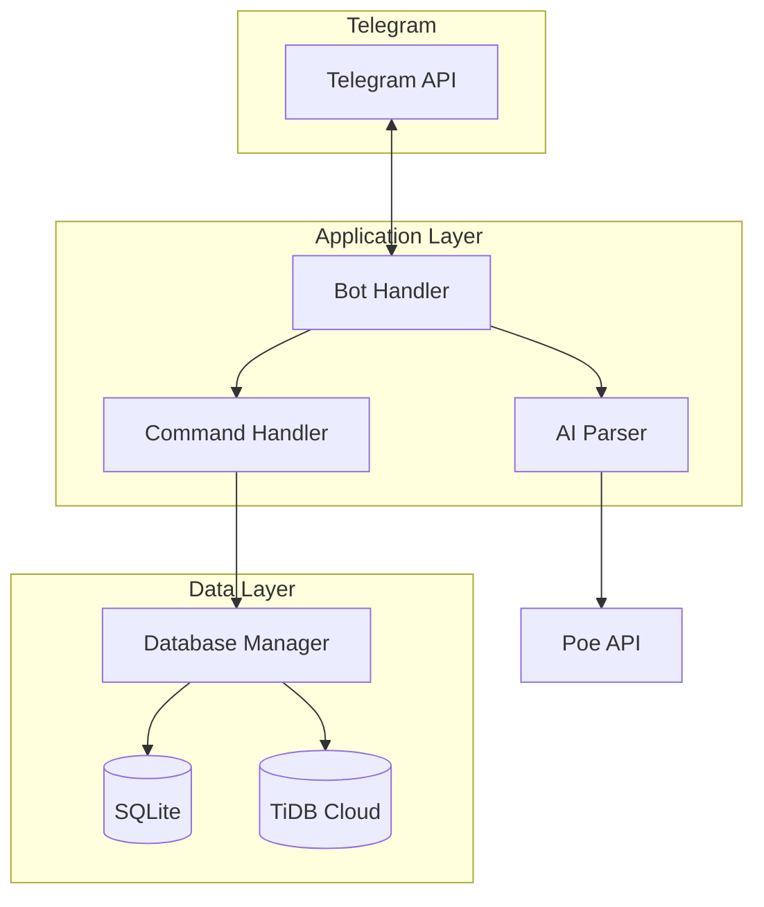

# Design Document

## Overview

Bot Telegram pencatat keuangan dengan AI parser yang memungkinkan pengguna mencatat transaksi menggunakan bahasa natural Indonesia. Sistem menggunakan arsitektur modular dengan dual database (SQLite lokal + TiDB Cloud) untuk reliabilitas data.

## Architecture



## Project Structure

```
telegram-money-tracker/
├── src/
│   ├── __init__.py
│   ├── main.py              # Entry point
│   ├── bot/
│   │   ├── __init__.py
│   │   ├── handler.py       # Telegram bot handlers
│   │   └── commands.py      # Command implementations
│   ├── ai/
│   │   ├── __init__.py
│   │   └── parser.py        # AI transaction parser
│   ├── database/
│   │   ├── __init__.py
│   │   ├── manager.py       # Database manager (dual DB)
│   │   ├── sqlite_db.py     # SQLite operations
│   │   └── tidb_db.py       # TiDB Cloud operations
│   └── models/
│       ├── __init__.py
│       └── transaction.py   # Transaction model
├── config/
│   └── settings.py          # Configuration
├── tests/
│   └── ...
├── data/
│   └── money_tracker.db     # SQLite database file
├── .env                     # Environment variables
├── pyproject.toml           # UV project config
└── isrgrootx1.pem          # TiDB SSL certificate
```

## Components and Interfaces

### 1. Bot Handler (`src/bot/handler.py`)

Komponen utama yang menangani interaksi dengan Telegram API.

```python
class BotHandler:
    def __init__(self, token: str, ai_parser: AIParser, db_manager: DatabaseManager):
        """Initialize bot with dependencies."""
        pass
    
    async def start(self) -> None:
        """Start the bot polling."""
        pass
    
    async def handle_message(self, update: Update, context: ContextTypes.DEFAULT_TYPE) -> None:
        """Handle incoming text messages for transaction parsing."""
        pass
```

### 2. Command Handler (`src/bot/commands.py`)

Menangani command-command Telegram.

```python
class CommandHandler:
    def __init__(self, db_manager: DatabaseManager):
        pass
    
    async def cmd_start(self, update: Update, context: ContextTypes.DEFAULT_TYPE) -> None:
        """Handle /start command."""
        pass
    
    async def cmd_history(self, update: Update, context: ContextTypes.DEFAULT_TYPE) -> None:
        """Handle /history command - show last 10 transactions."""
        pass
    
    async def cmd_summary(self, update: Update, context: ContextTypes.DEFAULT_TYPE) -> None:
        """Handle /summary [month] [year] command."""
        pass
    
    async def cmd_delete(self, update: Update, context: ContextTypes.DEFAULT_TYPE) -> None:
        """Handle /delete [id] command."""
        pass
```

### 3. AI Parser (`src/ai/parser.py`)

Menggunakan Poe API untuk parsing transaksi dari bahasa natural.

```python
@dataclass
class ParsedTransaction:
    type: str           # "income" or "expense"
    amount: float       # Normalized amount
    category: str       # Category name
    description: str    # Original description
    confidence: float   # Parsing confidence 0-1

class AIParser:
    def __init__(self, api_key: str):
        """Initialize with Poe API key."""
        pass
    
    def parse_transaction(self, message: str) -> ParsedTransaction | None:
        """Parse natural language message into transaction data."""
        pass
    
    def _build_prompt(self, message: str) -> str:
        """Build prompt for AI model."""
        pass
    
    def _parse_response(self, response: str) -> ParsedTransaction | None:
        """Parse AI response JSON into ParsedTransaction."""
        pass
```

### 4. Database Manager (`src/database/manager.py`)

Mengelola dual database dengan sync mechanism.

```python
class DatabaseManager:
    def __init__(self, sqlite_db: SQLiteDB, tidb_db: TiDBCloud):
        pass
    
    async def save_transaction(self, transaction: Transaction) -> bool:
        """Save to SQLite first, then sync to TiDB."""
        pass
    
    async def get_transactions(self, user_id: int, limit: int = 10) -> list[Transaction]:
        """Get transactions from SQLite."""
        pass
    
    async def get_summary(self, user_id: int, month: int, year: int) -> dict:
        """Get monthly summary."""
        pass
    
    async def delete_transaction(self, user_id: int, transaction_id: int) -> bool:
        """Delete from both databases."""
        pass
    
    async def sync_pending(self) -> None:
        """Sync pending transactions to TiDB Cloud."""
        pass
```

### 5. SQLite Database (`src/database/sqlite_db.py`)

```python
class SQLiteDB:
    def __init__(self, db_path: str):
        pass
    
    def init_tables(self) -> None:
        """Create tables if not exist."""
        pass
    
    def insert_transaction(self, transaction: Transaction) -> int:
        """Insert and return ID."""
        pass
    
    def get_transactions(self, user_id: int, limit: int) -> list[Transaction]:
        pass
    
    def mark_synced(self, transaction_id: int) -> None:
        """Mark transaction as synced to cloud."""
        pass
    
    def get_pending_sync(self) -> list[Transaction]:
        """Get transactions not yet synced."""
        pass
```

### 6. TiDB Cloud Database (`src/database/tidb_db.py`)

```python
class TiDBCloud:
    def __init__(self, host: str, port: int, user: str, password: str, database: str, ssl_ca: str):
        pass
    
    def insert_transaction(self, transaction: Transaction) -> bool:
        pass
    
    def delete_transaction(self, transaction_id: int) -> bool:
        pass
    
    def test_connection(self) -> bool:
        """Test if connection is available."""
        pass
```

## Data Models

### Transaction Model (`src/models/transaction.py`)

```python
from dataclasses import dataclass
from datetime import datetime
from typing import Optional

@dataclass
class Transaction:
    id: Optional[int]
    user_id: int
    type: str              # "income" or "expense"
    amount: float
    category: str
    description: str
    created_at: datetime
    synced: bool = False   # Whether synced to TiDB
    
    def to_dict(self) -> dict:
        """Convert to dictionary for database."""
        pass
    
    @classmethod
    def from_dict(cls, data: dict) -> "Transaction":
        """Create from database row."""
        pass
    
    def format_display(self) -> str:
        """Format for Telegram display."""
        pass
```

### Database Schema

```sql
-- SQLite & TiDB (same schema)
CREATE TABLE IF NOT EXISTS transactions (
    id INTEGER PRIMARY KEY AUTOINCREMENT,
    user_id BIGINT NOT NULL,
    type VARCHAR(10) NOT NULL,  -- 'income' or 'expense'
    amount DECIMAL(15, 2) NOT NULL,
    category VARCHAR(50) NOT NULL,
    description TEXT,
    created_at TIMESTAMP DEFAULT CURRENT_TIMESTAMP,
    synced BOOLEAN DEFAULT FALSE,  -- SQLite only
    INDEX idx_user_id (user_id),
    INDEX idx_created_at (created_at)
);
```

### Default Categories

```python
EXPENSE_CATEGORIES = [
    "makanan", "transportasi", "belanja", "tagihan", 
    "hiburan", "kesehatan", "pendidikan", "lainnya"
]

INCOME_CATEGORIES = [
    "gaji", "bonus", "freelance", "investasi", "hadiah", "lainnya"
]
```


## Correctness Properties

*A property is a characteristic or behavior that should hold true across all valid executions of a system-essentially, a formal statement about what the system should do. Properties serve as the bridge between human-readable specifications and machine-verifiable correctness guarantees.*

### Property 1: Transaction Persistence Round Trip

*For any* valid Transaction object, saving it to the database and then retrieving it by ID should return an equivalent Transaction with matching user_id, type, amount, category, and description.

**Validates: Requirements 1.2, 3.1**

### Property 2: Transaction Display Completeness

*For any* Transaction object, the formatted display string should contain the date, category, amount (formatted as currency), and description.

**Validates: Requirements 1.3, 2.4**

### Property 3: History Limit and Order

*For any* database state with N transactions for a user, calling get_transactions with limit=10 should return min(N, 10) transactions ordered by created_at descending (newest first).

**Validates: Requirements 2.1**

### Property 4: Summary Calculation Correctness

*For any* set of transactions within a given month/year, the summary should satisfy: total_income equals sum of all income transactions, total_expense equals sum of all expense transactions, and balance equals total_income minus total_expense.

**Validates: Requirements 2.2, 2.3**

### Property 5: Pending Sync Marking

*For any* transaction where TiDB Cloud sync fails, the transaction in SQLite should have synced=False, and it should appear in the pending sync list.

**Validates: Requirements 3.3**

### Property 6: Delete Removes from Database

*For any* existing transaction, after calling delete_transaction, querying for that transaction ID should return None/empty.

**Validates: Requirements 5.1**

### Property 7: Amount Normalization

*For any* Indonesian amount string (e.g., "50rb", "5jt", "100k"), the normalization function should convert it to the correct numeric value (50000, 5000000, 100000 respectively).

**Validates: Requirements 6.3**

### Property 8: Parser Output Structure

*For any* successful parse result, the ParsedTransaction should have non-empty type (either "income" or "expense"), positive amount, non-empty category, and description field present.

**Validates: Requirements 6.4**

### Property 9: Error Handling Resilience

*For any* database operation that raises an exception, the application should catch the error and return a graceful failure response without crashing.

**Validates: Requirements 4.4**

## Error Handling

### Error Categories

1. **Network Errors**: Telegram API atau TiDB Cloud tidak tersedia
   - Retry dengan exponential backoff
   - Fallback ke SQLite untuk database operations

2. **Parse Errors**: AI gagal memahami pesan
   - Return None dari parser
   - Bot meminta klarifikasi dari user

3. **Database Errors**: SQLite atau TiDB error
   - Log error dengan detail
   - Return error message ke user
   - Mark transaction as pending sync jika TiDB fails

4. **Validation Errors**: Data tidak valid
   - Return specific error message
   - Tidak menyimpan data invalid

### Error Response Format

```python
class BotResponse:
    success: bool
    message: str
    data: Optional[dict]
    error_code: Optional[str]
```

## Testing Strategy

### Unit Testing

Menggunakan `pytest` untuk unit tests:

1. **AI Parser Tests**
   - Test amount normalization function
   - Test prompt building
   - Test response parsing (mock AI response)

2. **Database Tests**
   - Test CRUD operations pada SQLite
   - Test sync mechanism
   - Test pending sync retrieval

3. **Model Tests**
   - Test Transaction serialization/deserialization
   - Test format_display output

4. **Command Tests**
   - Test command parsing
   - Test response formatting

### Property-Based Testing

Menggunakan `hypothesis` library untuk property-based tests:

1. **Transaction Round Trip**: Generate random transactions, save and retrieve, verify equality
2. **Summary Calculation**: Generate random transaction sets, verify sum calculations
3. **Amount Normalization**: Generate Indonesian amount strings, verify conversion
4. **Display Completeness**: Generate transactions, verify all fields in output

### Test Configuration

- Minimum 100 iterations per property test
- Each property test tagged with: `**Feature: telegram-money-tracker-bot, Property {number}: {property_text}**`

### Test File Structure

```
tests/
├── __init__.py
├── conftest.py              # Pytest fixtures
├── test_parser.py           # AI parser tests
├── test_database.py         # Database operation tests
├── test_models.py           # Model tests
├── test_commands.py         # Command handler tests
└── test_properties.py       # Property-based tests
```

## Configuration

### Environment Variables (.env)

```env
# Telegram
TELEGRAM_BOT_TOKEN=8485161546:AAESEOdD3LoEg85p9tetTnT9O2dZVwmg4kM

# Poe API
POE_API_KEY=lfoiS0RjPzIv8r86djO_OaXdTqh6Md1BdzLNTN9Mutw
POE_BASE_URL=https://api.poe.com/v1
POE_MODEL=gemini-2.5-flash

# TiDB Cloud
TIDB_HOST=gateway01.ap-southeast-1.prod.aws.tidbcloud.com
TIDB_PORT=4000
TIDB_USER=3SPaBidr6wJMpan.root
TIDB_PASSWORD=wqyhnLj53UpT3RkH
TIDB_DATABASE=test
TIDB_SSL_CA=isrgrootx1.pem

# SQLite
SQLITE_PATH=data/money_tracker.db
```

### Settings Module (`config/settings.py`)

```python
from pydantic_settings import BaseSettings

class Settings(BaseSettings):
    telegram_bot_token: str
    poe_api_key: str
    poe_base_url: str = "https://api.poe.com/v1"
    poe_model: str = "gemini-2.5-flash"
    
    tidb_host: str
    tidb_port: int = 4000
    tidb_user: str
    tidb_password: str
    tidb_database: str
    tidb_ssl_ca: str
    
    sqlite_path: str = "data/money_tracker.db"
    
    class Config:
        env_file = ".env"
```

## Dependencies (pyproject.toml)

```toml
[project]
name = "telegram-money-tracker"
version = "0.1.0"
requires-python = ">=3.11"
dependencies = [
    "python-telegram-bot>=21.0",
    "openai>=1.0.0",
    "pymysql>=1.1.0",
    "pydantic-settings>=2.0.0",
    "python-dotenv>=1.0.0",
]

[project.optional-dependencies]
dev = [
    "pytest>=8.0.0",
    "pytest-asyncio>=0.23.0",
    "hypothesis>=6.100.0",
]
```
